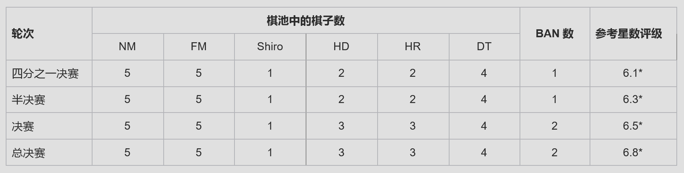
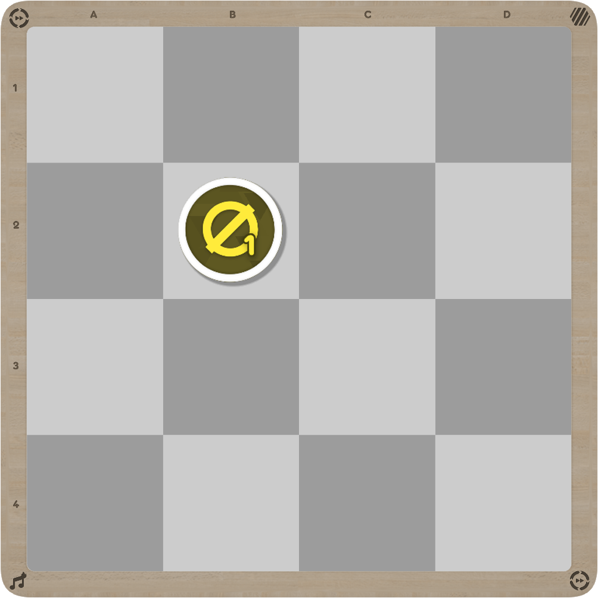
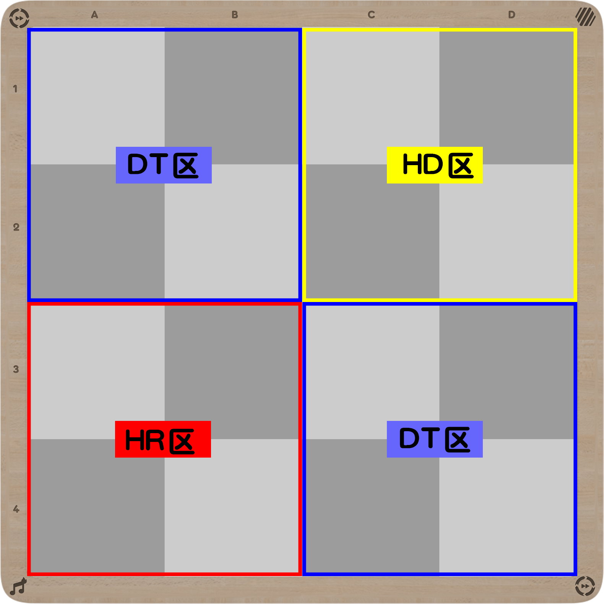
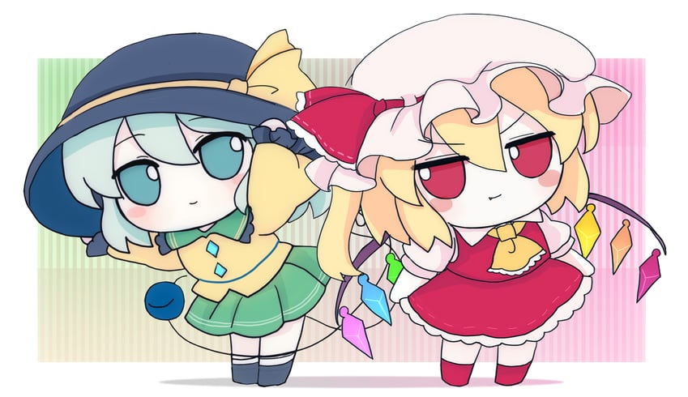
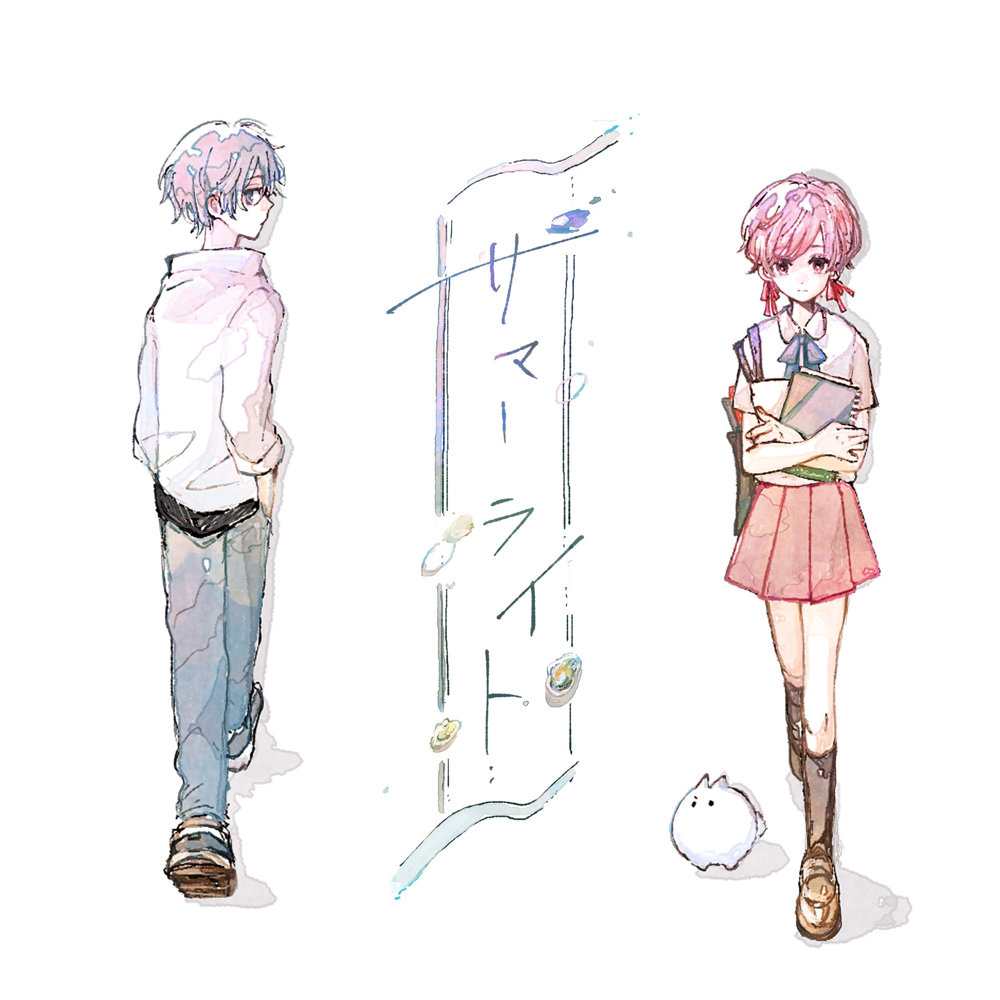
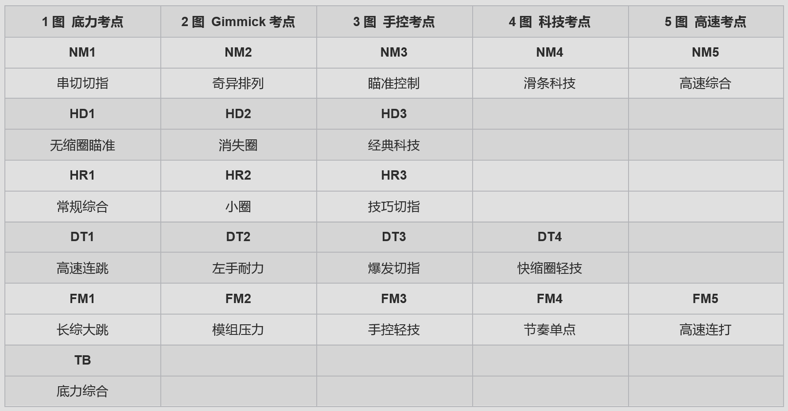

# <Highlight color="#269ffe">OFFC Summer Lights</Highlight> 参赛手册

:::info 版本信息

你在阅读的是参赛手册的最新版本！

当前版本于 **2025 年 6 月 23 日**更新，将不定期与腾讯文档同步。

若要获取最新更新，请在腾讯文档阅读参赛手册。

  <a href="https://docs.qq.com/doc/DVG15aUFITVVQYUZp" className="modern-button" target="_blank" rel="noopener noreferrer">
    📋
    查看腾讯文档
    →
  </a>

:::

## 一、总述

1. <Highlight color="#269ffe">**osu! FumoFumo Cup: Summer Lights**</Highlight>（后简称 <Highlight color="#269ffe">**OFFC:SL**</Highlight>）是建立在 osu! 传统比赛制度基础之上，融合了全新下棋 ban/pick 玩法的 osu! stable 中文社区锦标赛。比赛没有 Badge。比赛在 osu! 官方服务器（bancho）进行，对决方式为 Team VS，队伍大小为 9-10 人，对战规模为 4v4，采用 Score V2 计分，强制开启 No Fail。
2. OFFC:SL 采用**个人报名**。本届比赛拥有两种个人报名表：选手报名表用于申请成为在比赛中上场打图的玩家，选手报名的全球排名要求为 <FntColor color="#269ffe">**#10,000 - #99,999**</FntColor>；策略师报名表用于申请成为在比赛中协助 ban/pick 和走棋布局的场外玩家，策略师报名的全球排名要求为 <FntColor color="#269ffe">**#1 - #99,999**</FntColor>。
3. OFFC:SL 采用**选秀组队**。审查结束后，所有选手进入选秀环节。选秀共排出 8 支队伍，队长在选秀前会被安排好。选秀环节，队长轮转挑选选手。8 支队伍排出后，剩余的选手淘汰。此后，队伍按照双向志愿规则挑选策略师。未入选的策略师淘汰。
4. OFFC:SL 采用**双败淘汰**赛制。淘汰赛共有 4 大轮，每轮图池均不相同[^注1]且图池难度随轮次递增。比赛中所用到的所有谱面在 NoMod 下的星数评级介于 <FntColor color="#269ffe">**4.00\*-7.00\***</FntColor>。比赛过程中，对战双方需要在棋盘上轮流下棋进行比拼。优先获得四连对的队伍取得本场比赛的胜利。
5. 每场比赛的默认时间均以 <FntColor color="#269ffe">**UTC+8**</FntColor> 为基准给出。工作人员不额外帮助参赛队伍协定比赛时间。
6. 选手在报名截止前可以因合理的理由申请个人退赛。[^注2]
7. 对于比赛中、比赛外出现的与 OFFC:SL 有关的一切意外事件，**OFFC:SL 工作人员对其拥有最终解释权**。

### 赛程

- 报名/审查：6.15 ~ 6.30
- 选秀组队：7.1
- 四分之一决赛：7.1 ~ 7.14 | 图池展示：7.1
- <Highlight color="#673ab7">China LAN休赛</Highlight>[^注3]：7.9 ~ 7.15
- 半决赛：7.16 ~ 7.29 | 图池展示：7.15
- 决赛：8.1 ~ 8.14 | 图池展示：7.30
- <Highlight color="#673ab7">OCNCC 休赛</Highlight>：7.31 ~ 8.10
- 总决赛：8.16 ~ 8.22 | 图池展示：8.15

:::info OFFC:SL比赛特色

- 独创的走棋玩法，让战场风云莫测；
- 系统性规划的赛图图池，内含多个定制图；
- 沉浸式夏日主题，一条完整的故事线贯穿整个比赛；
- 焕然一新的直播视觉效果；
- 有趣的比赛奖品，等等。

:::

## 二、玩家报名与组队

OFFC:SL中，每支队伍由两种成员组成：<FntColor color="#269ffe">**“选手”与“策略师”**</FntColor>。

- <FntColor color="#269ffe">**选手**</FntColor>的主要任务是上场游玩赛图进行对决，即**打图**。
- <FntColor color="#269ffe">**策略师**</FntColor>的任务是赛前协助队伍分析练图出分、赛中 ban/pick 时谋划我方下一步如何**行棋**。

### （一）选手报名要求与组队要求

1. 任何玩家，只要在报名期间填写选手报名表，在通过审查确认其具有参赛资格后即可作为选手参加比赛。所谓参赛资格指的是如下条件：
    - 全球排名在 #10,000 - #99,999 区间内，包括两端。[^注4]报名只受到原始全球排名的限制。[^注5]本届比赛不设置待定区。[^注6]
    - 选手账号无禁言以外的不良记录。
2. 玩家需要以个人名义填写选手报名表。成功提交后，工作人员会将玩家信息同步到主表格中，并且在 1 个工作日之内进行审查。
3. 一个队伍内有且仅有 **8 名**选手（其中 1 名担任队长）。
4. 报名结束后，主表格中显示所有选手的 SKILL 分数[^注7]，然后所有选手进入选秀阶段。
5. 主要游玩 osu!lazer 的玩家，我们默认其同样有能力在 osu! stable 中进行比赛。

### （二）策略师报名要求与组队要求

1. 任何玩家，只要在报名期间填写策略师报名表，在通过审查确认其具有参赛资格后即可作为选手参加比赛。所谓参赛资格指的是如下条件：
    - 报名玩家的全球排名区间在 #1 - #99,999 区间内，包括两端。报名只受到全球排名的限制。不设置待定区。
    - 策略师账号无禁言以外的不良记录。
2. 玩家需要以个人名义填写[策略师报名表](https://docs.qq.com/form/page/DVHBkd2JYa2VTbVBn)。成功提交后，工作人员会将玩家注册到主表格中的“策略师”页面内。
3. 一个队伍内有**至少 1 名、至多 2 名**策略师。
4. 报名结束后，所有策略师进入选秀阶段。
5. **策略师不可以上场参与打图，且需要在游戏开始前离开 mp 房间。**

### （三）选秀实施办法

报名结束后，应有至少 64 名选手和若干名策略师进入该阶段。

#### 1. 选手选秀

1. 初始 8 支队伍（A~H 队），每个队伍的队长会预先分配好。
2. 队长按照轮转次序挑选7轮（A-H，H-A，...，A-H）。每轮每队队长需从名单中挑选任意 1 名选手加入自己的队伍。
3. 队长需在 QQ 队长群中发送选手的 osu! 用户名来挑选选手。被挑选的选手直接加入队伍，并且从名单中剔除。7 轮结束后，预期排出 8 支队伍，每队 8 人。仍未加入组队的选手淘汰。
4. 选手的挑选不可反悔。

#### 2. 选择策略师

1. 8 支队伍的选手全部确认后，所有策略师进入在线选秀表格，选择任意 1 支队伍。所有策略师有 5 分钟的时间选择队伍。
2. 如果有策略师没有选择任何一支队伍，那么这些策略师将依次被分配到策略师人数最少的队伍中。如果符合要求的有多支队伍，那么这些策略师将被 Roll 点随机分配到其中一个队伍。
3. 所有策略师均志愿 1 次后，队长进行策略师的挑选。队长只能从选择自己队伍的策略师中进行挑选。队长需挑选至少 1 名、至多 2 名策略师。挑选完毕后，队长需要向管理员确认组队完成。已完成组队的队伍将离开反向选秀阶段。
4. 倘若有队伍没有策略师可供挑选，或者有队长没有挑选策略师，那么所有未正式入队的策略师需重新填报志愿。在第 2 次及更多次策略师的志愿中，策略师无法选择已经完成组队的队伍。重复该流程直到所有队伍均确认组队完成。仍未加入组队的策略师淘汰。

### （四）取消资格（赛前或赛中）

1. 拥有以下任一情况的选手会被<FntColor color="#d05677">**取消个人参赛资格**</FntColor>：
    - 存在实锤的小号、代打情况；
    - 在 2025.1.1 至 2025.6.1 期间没有 osu! stable 或 osu!lazer 任何一个模式的游玩记录；
    - 散播谣言、侮辱诽谤、人身攻击、贩卖消极情绪并对他人影响恶劣。
2. 拥有以下任一情况的选手会被<FntColor color="#d05677">**取消个人及其所在团队的参赛资格**</FntColor>：
    - 在赛场上使用辅助程序和外挂。

## 三、基本物件介绍

OFFC:SL 是下棋比赛，比赛用到的基本物件有棋子和棋盘。

### （一）棋池（图池）介绍

1. 每轮比赛会提供一个棋池，棋池内部有诸多棋子。下图展示了比赛中可能出现的所有棋子。

    

2. 第一排显示了所有可供玩家选出、游玩、比拼的棋子，从左到右依次是：NM1、HD1、HR1、DT1、FM1 和 Shiro。棋子的图案表明棋子所属于的 MOD 属性，右下角的数字表明棋子在当前 MOD 池中的位置。棋子的图案和数字唯一确定一张赛图。这些棋子被选出后，对战双方立刻就其对应的赛图进行比拼。特别地，Shiro 没有图案和数字，因此它没有任何赛图对应。
3. HD、HR 和 DT 是相互排斥的 MOD 属性，而 NM、FM 和 Shiro 则可以和任意 MOD 属性相兼容。FM 规则为：一人HD（或 EZ+HD）、一人 HR[^注8]、一人 NM（或 EZ）、一人 FM。FM 位置的要求与后续棋盘的 MOD 限定区域有关。
4. 第二排显示了棋子的三个状态：由红队持有、由蓝队持有、死亡。对战双方就赛图比拼结束后，获胜的那一方将持有该棋子，棋子的图案转变为“奖杯”形状，颜色与获胜方队伍相同。这些队伍的赢棋将参与连对判定，取得四连对的队伍将获得比赛的胜利。当队伍决定进行夺棋时，被牺牲的棋子会进入死亡状态，其图案转变为灰色的奖杯。这些死亡的棋子无法参与连对判定。
5. 特别地，由于 Shiro 没有赛图对应，其被选出后双方不进行打图，直接进入下一回合。想要将 Shiro 由己方队伍持有，必须进行夺棋。
6. 如果在图池展示后，赛图出现更新、上架状态改变等情况，需按照主办方给出的解决办法进行调整。

下表展示了本届 OFFC:SL 每一轮次的棋池规模。

### （二）棋盘

1. 棋盘是一个 4x4 的正方形网格。棋盘上的小格用于放置棋子，每个小格只能放入 1 个棋子，如下图。

    

2. 如图所示，棋盘行的命名为 1, 2, 3, 4，列的命名为 A, B, C, D。每个格子的位置由行列坐标唯一指定，默认行列坐标始终以字母开头。如上图中 NM1 所在格子的名称为“B2”。
3. 进一步地，棋盘被切分为四个 2x2 的区域，每个区域有自己的 MOD 属性。区域的 MOD 属性由棋盘四个角落上的图案给出，分别有 HD 区、HR 区和 DT 区。区域内只能接受和区域 MOD 属性相兼容的棋子，不能接受 MOD 属性相排斥的棋子。当 FM 棋子被选出后，FM 规则中的“FM 位”会被同化成和区域 MOD 属性相同的 MOD 位。具体情况见下图和下表。

    

    | 名称	  |        区域范围	        |      兼容的棋子      |             FM的同化             |
    |:----:|:-------------------:|:---------------:|:-----------------------------:|
    | HD 区 |     C1:D1（右上角）	     | NM、FM、HD、Shiro	 |   FM 位须携带 HD 或 2 倍分数的 HD/EZ   |
    | HR 区 |     A3:B4（左下角）	     | NM、FM、HR、Shiro	 |          FM 位须携带 HR           |
    | DT 区 | A1:B2 C3:D4（棋盘剩余部分） | NM、FM、DT、Shiro	 | FM 位须游玩 NoMod 或携带 1.8 倍分数的 EZ |

## 四、行棋玩法规则

策略师必须仔细阅读行棋玩法规则，并观看玩法教学视频。我们推荐队长也对行棋玩法规则有一定的了解。其他选手可以结合自己的兴趣与精力自行选择是否参与这部分游戏内容。

:::info 快捷帮助

- 队伍在 OFFC:SL 的目标只有一个，就是打赢尽可能多的图，持有更多棋子！在棋盘合适的位置落下合适的棋子，打赢这张图，把棋子赢下来。想办法让你的获胜棋连成一个四连对，赢得比赛。
- 当然，你的对手也在努力完成他们的四连对。因此，你需要一些办法阻止对手完成他们的连对。比如，精准地 ban 掉对手擅长的棋子，或者在对手的连对路线上选出白子进行阻挡，以破坏对手的连对。
- 棋盘上有不同的 MOD 区域。结合自己队伍最擅长的 MOD 和 SKILL，优先在 MOD 区域里建立起优势是一个不错的起手。之后，围绕自己的优势选择合适的连对线路。
- OFFC:SL 每轮棋池有共计 5 颗 FM 棋。由于 FM 棋相对 NM 棋难度较低，同时又能充分发挥自己队伍的MOD实力，因此优先谋划 FM 棋是一个很好的主意。
- 白子可能对战局的走向起到很重要的影响。棋池里面只有一个白子，因此是先到先得。但是，抢白就意味着要拖延自己一回合的选棋。
- 由于落子留出的时间比较短，我们推荐策略师在双方选手打图的时同时候谋划自己队伍下一落子的选择。
- 夺棋只有一次机会，最好留到绝杀无解的时候。

:::

### （一）连对与获胜条件

1. 队伍持有的棋子在棋盘上会形成不同的连对。连对的定义见下表。

    | 连对	  | 定义                                        |
    |:----:|:------------------------------------------|
    | 二连对	 | 同一方的获胜棋横向或者纵向边靠边连续出现2次，称为一个二连对。（二连对无斜向判定） |
    | 三连对	 | 同一方的获胜棋边靠边横向、纵向或者角对角斜向连续出现3次，称为一个三连对。     |
    | 四连对	 | 同一方的获胜棋边靠边横向、纵向或者角对角斜向连续出现4次，称为一个四连对。     |

2. 每个所持有的棋子只能参与到某一个最高连对中。也就是说，连对不可以重叠。例如：一个三连对只能被视为一个三连对，而无法被拆分为两个二连对。实际上，在当前规则下，这样的拆分没有任何意义。
3. 本届 OFFC:SL 的基本玩法是：<u>两队在棋盘上轮流行动，争取使自己持有的棋子形成四连对。</u>一旦某队伍持有的棋子形成四连对，该队伍就取得本场比赛的胜利。

### （二）落子与夺棋

1. 比赛以回合为单位按序推进。双方轮流落子，每一次落子视为一个回合。（“落子”的概念可参照常规比赛的“Pick”来理解）
2. 在 Ban 图环节结束后，总是由红队率先落子。红队完成落子后，蓝队开始落子，此后两队按顺序交替落子（可参照常规比赛的轮流 Pick 来理解）。
3. 每一队在轮到自己行动时只能且必须从以下两种落子方式中选择一种：

    | 落子方式	 | 操作和效果	                                                       | 备注                         |
    |:-----:|:-------------------------------------------------------------|:---------------------------|
    | 普通落子	 | 选择一张谱面作为棋子，并从棋盘上选择一个位置进行落子；接着两队立即就该谱面进行对决，胜者将持有该棋子，进入下一回合。   | 普通落子！史诗落子！传说落子！SSR 落子！（发癫） |
    | 白子落子	 | 从棋盘上选择一个位置落下白子，此时白子不受任何一方持有；落下白子之后，行动即告结束，不需要游玩任何谱面，进入下一回合。	 | 每场比赛只有一个白子，即只有一方能进行白子落子。   |

4. 每一队在落子之前可以选择付出一定代价并进行夺棋。但是，每场比赛中每队只能夺棋一次，不论选择的是哪种夺棋。

    | 夺棋方式	       | 操作和效果	                                                        | 备注                                 |
    |:------------|:--------------------------------------------------------------|:-----------------------------------|
    | 夺取对方所持有的棋子	 | 牺牲己方持有的一个三连，来获得对方任意一颗棋子的持有权；或牺牲己方持有的两个不同的二连，来获得对方任意一颗棋子的持有权。	 | 被牺牲的棋子将变成灰色，不会被移除，不参与连对判定，也无法再被夺取。 |
    | 夺取白子	       | 牺牲己方持有的任意两颗棋子，来获得白子的持有权。                                      |                                    |

5. 队伍夺棋后，仍然需要继续执行落子。夺棋与落子的结算顺序为：双方就谱面对决后，更新当前棋子的持有状态，随后进行连对和获胜判定；夺棋后，先牺牲己方的棋子，然后更新被夺棋子的持有状态，随后进行连对和获胜判断。

### （三）TB（TieBreaker）

为防止游戏无法正常结束，我们仍然设置了 TB 环节。在 TB 中获胜的一队将取得本场比赛的胜利。以下情况均可以进入 TB：

- 死局。若任意一方在其行动时无法落子，且夺棋也不可能形成任何四连，比赛将强制进入 TB。
- 协商。当满足以下任一条件时，任意一方可以提出 TB 申请。若另一方同意，则进入 TB；若另一方不同意，则比赛继续进行。
    - 比赛已经进入第 13 回合（即第 13 次落子）；
    - 或双方在不夺棋的情况下已不可能形成任何四连（此时裁判将给出提示）。

### （四）投子认输

1.  比赛进行到第 8 回合及以后时，只要对手有一个三连对，己方就可以发起投子认输。投子认输需要队伍内**包括队长在内的 5 名选手和至少 1 名策略师**在 mp 房间中发送确认人数的指令。
2.  己方投子认输后，对方直接获得本场比赛的胜利。
3.  本届比赛不设置握手言和。
    以上的诸多规则，如落子区域是否允许、FM 规则、夺棋条件是否满足、TB 条件是否满足、投子认输条件是否满足等判断，会由裁判和直播端在落子环节给出相应的信息提示。

:::info 提示

以上的诸多规则，如落子区域是否允许、FM规则、夺棋条件是否满足、TB条件是否满足、投子认输条件是否满足等判断，会由裁判和直播端在落子环节给出相应的信息提示。

:::

## 五、淘汰赛流程

视报名人数的规模而定，OFFC:SL 计划的总队伍数量为 8 队。倘若报名截止时无法集齐8支队伍，则启用 8 队 6 人 3v3，相应的 FM 规则等也会发生变化。

本届比赛不设置资格赛。

### （一）淘汰赛

1. 进入淘汰赛阶段后将会给出对阵表，请参见主表格对阵图一栏。默认每场比赛评分较低的一队作为红队，评分较高的一队作为蓝队。
2. 裁判会在比赛前 15 分钟提醒参与当前淘汰赛的所有选手，并分别在比赛前 10 分钟、比赛前 5 分钟和比赛开始时邀请所有选手至比赛房间。
3. 淘汰赛每个队伍上场选手数为 4 人。mp 房间中红队占 1-4 楼，蓝队占 5-8 楼。比赛在约定时间开始的 15 分钟后，上场选手人数不足 4 人的队伍直接视为投子认输。
4. 本届比赛设置 Bracket Reset。不设置赛前热手。

### （二）淘汰赛流程

1. 始终以红队作为 BAN 棋、PICK 棋的先手方。
2. 双方选手到场后，进入 BAN 棋环节。由红队优先 BAN 棋。然后蓝队 BAN 棋。BAN 棋顺序为**红-蓝**或**红-蓝-蓝-红**。
3. BAN 棋环节结束后进入 PICK 棋环节，第 1 回合开始。红队优先选择 PICK 棋。队长需要在 mp 房间中给出所选择的棋（如 NM1，HD2 等）以及落子所在格子的位置（如第三行第四列、D3 等）。落子完成后，双方游玩该棋子对应的赛图进行比赛。赢得本张赛图队伍将该棋子赢得为己方的获胜棋。结算完成后，进入下一回合，交换落子权。此后同上并循环往复直至出现四连对或进入 TB。
4. 赛中，倘若有队伍选择了 Shiro，那么不打图，直接进入下一回合，交换落子权。
5. 赛中，倘若满足条件，队伍可以在自己的 PICK 回合中进行夺棋。夺棋需要在落子前进行，一旦落子就直接进入打图环节，不可以夺棋。夺棋后进行结算，如果游戏没有结束，则当前队伍继续正常落子进行游戏。

:::info 提示
- BAN、PICK、夺棋、TB 的申请和投子认输指令均以队长发出为准。除非队长提前向裁判指定了临时队长，否则队伍内除队长外的任何成员（包括策略师）发送的游戏指令都不会被受理。
- 指定落子所在格子位置时，推荐使用格子名称进行指定。格子名称请参照本手册 3.2.棋盘一栏。倘若使用其他表示方法，均默认其位置信息按照 mp 消息的阅读顺序理解为先列后行。
- 允许策略师在落子环节进入 mp 房间。在打图开始前，所有策略师必须离开 mp 房间。
- 允许 Double Ban 和 Double Pick。
:::

### （三）回合内行动 mp timer 的时间限制

1. 回合内事件之间通过裁判给出的 mp timer 倒计时器规定时间间隔，时间间隔可以参照下表。
2. 夺棋和落子共用同一个 120 秒的倒计时。超时会自动使用一次暂停机会。倘若 timer 结束有队伍没有完成上人，裁判稍作等待后直接开启本回合对局。
3. 倘若选手在歌曲的前四分之一部分内掉线，导播或掉线队友需要联系裁判进行重赛。

|    回合内事件	     | 时间间隔限制（秒）	 |     是否允许暂停     |
|:-------------:|:----------:|:--------------:|
|     BAN棋	     |    120	    |       否        |
|    第1回合落子	    |    150     |       	否       |
| 第2-16回合夺棋、落子	 |    120     |       	是       |
|   落子后上人准备	    |     90     |       	否       |
|    TB前准备	     |    180	    |       是        |
|     申请暂停      |   	+180	   | 每个队伍每场比赛1次暂停机会 |

## 六、奖品

### （一）osu!内纪念奖牌

1. 所有参赛选手会获得定制 Profile Banner + QQ 赛群头衔。冠军、亚军、季军队伍的参赛选手会有特殊的 Banner 和头衔。
2. 所有 OFFC:SL 工作人员会获得定制 Profile Banner。
3. 所有定制图 Mappers 会获得定制图 Banner。

### （二）Round Champion奖牌

1. 四分之一决赛、半决赛、决赛和总决赛整体表现最佳的全体队伍成员将会获得相应轮次的 Champion 实体纪念奖牌。奖牌的获得从总决赛开始向下结算，同一支队伍只能领取一种等级最高的奖牌，等级次之的奖牌会顺位给表现次佳的队伍。
2. 奖牌属于纪念品，不属于奖池。

### （三）实体奖品奖池

1. 实体奖品的发放采用奖池选一剩一制。同一玩家不可同时获得多个奖池的奖品。此时，奖品会顺位给满足条件的下一位玩家。以下的配图均为网络概念图，实际奖品均为全新未拆封。
2. 不便接受实体奖品的玩家可以选择领取 1 个月的 osu! supporter tag。
3. 如果有玩家不便接受实体奖品而选择 osu! supporter tag，那么实体奖品会顺位给下一位满足条件的玩家发放。若下一位玩家仍然不便接受实体奖品，则奖项作废。

#### 东方 Project Fumo 奖池

奖池：**古明地恋 Fumo、芙兰朵露 Fumo**

冠军队伍总决赛总体表现最高的选手可以从 Fumo 奖池内的两个 Fumo 二选一作为自己的奖品。剩下的另一个 Fumo 奖励给亚军队伍总决赛总体表现最高的选手。（插图：こいふら）

#### 碧蓝档案奖池

奖池：**霞泽美游盛夏派对立牌+吧唧、阿慈谷日富美盛夏派对立牌+吧唧**

最佳计谋策略师投票的胜出者可以从碧蓝档案奖池内的两组盛夏派对二选一作为自己的奖品。剩下的另一组奖品奖励给最佳劳模策略师投票的胜出者。（插图：碧蓝档案）

|                  霞泽美游                   |                    阿慈谷日富美                     |
|:---------------------------------------:|:---------------------------------------------:|
|  |  |

#### 音乐唱片奖池

奖池：**だから僕は音楽を辞めた【初回限定盤】（ヨルシカ）、サマーライト（夏央、倚水）**

- 比赛结束后，HD 总分最高的选手可以获得一张《所以我放弃了音乐》初回限定实体 CD 音乐专辑（音乐 CD + 写给 Elma 的信与照片+歌词卡）（2025 年 8 月再版）。如果整场比赛没有 HD 位置的图被选出，则该奖项作废。
- 比赛结束后，HR 总分最高的选手可以获得一张《夏光》实体 CD 音乐专辑。如果整场比赛没有 HR 位置的图被选出，则该奖项作废。

|                          《所以我放弃了音乐》                           |                     《夏光》                     |
|:-------------------------------------------------------------:|:--------------------------------------------:|
|  |  |

:::info 信息

- HD 总分 = 选手上场的任一 HD 位置的得分总和。任一 HD 位置，包括所有 HD 棋的分数、所有 FM 棋 HD 位的分数、所有 FM 棋被 HD 区同化的 FM 位分数。如果有选手携带 EZ+HD，则按照出分成绩的两倍计算。
- HR 总分 = 选手上场的任一 HR 位置的得分总和。任一 HR 位置，包括所有 HR 棋的分数、所有 FM 棋的 HR 位的分数、所有 FM 棋被 HR 区同化的 FM 位分数。如果有选手携带 HD+HR，则按照出分成绩的一倍计算。
- 如果 HD 总分最高者与HR总分最高者为同一位选手，那么该选手可以自选一张音乐唱片作为奖品。未被选择的另一张唱片按照规则发放给分数顺位的选手。

:::

## 七、注意事项和补充说明

总则：对于比赛中、比赛外出现的与 OFFC:SL 有关的一切意外事项，OFFC:SL 工作人员对其拥有最终解释权。

### （一）违规惩罚机制

1. 任何一位正常参与并体验比赛的玩家都可以自行屏蔽这段内容。OFFC:SL 主办方对“违规”的界定十分严苛，一般的失误行为不会被界定为”违规“。如果你实在担心自己可能会出现违规行为，可以阅读本栏。
2. 比赛的全流程中，每轮图池展示结束后，工作人员会按轮次浏览比赛回放、查看 QQ 赛群聊天记录，对参赛玩家的违规行为进行审查。

主办方认定的违规行为可以参照下表。

<table>
    <colgroup>
        <col/>
        <col style={{minWidth: "6rem", alignContent: "center"}}/>
    </colgroup>
    <thead>
        <tr>
            <th>违规行为</th>
            <th>严重程度</th>
        </tr>
    </thead>
    <tbody>
        <tr>
            <td>在 QQ 赛群或者 mp 比赛房间内发布有政治倾向的言论、上传特别恶劣的 R18、R18G 内容</td>
            <td><FntColor color="#d05677">不可容忍</FntColor></td>
        </tr>
        <tr>
            <td>在任何社交媒体公开发表对 OFFC:SL 的恶意攻击与诽谤</td>
            <td><FntColor color="#d05677">不可容忍</FntColor></td>
        </tr>
        <tr>
            <td>恶意人身攻击、诽谤、阴阳怪气、压力其他比赛选手或 OFFC:SL 工作人员</td>
            <td><FntColor color="#d05677">不可容忍</FntColor></td>
        </tr>
        <tr>
            <td>选手在 OFFC:SL 进入四分之一决赛后无故申请退赛</td>
            <td><FntColor color="#d05677">不可容忍</FntColor></td>
        </tr>
        <tr>
            <td>选手在比赛的对局中无故摆烂、放置、瞎打</td>
            <td><FntColor color="#f29f00">稍加批评</FntColor></td>
        </tr>
        <tr>
            <td>策略师无视队长指令或不协助队长进行 ban/pick、胁迫或压力队长、破坏队伍内练图表、透露队伍内练图成绩、多次没有在实战中参与走棋参谋</td>
            <td><FntColor color="#f29f00">稍加批评</FntColor></td>
        </tr>
        <tr>
            <td>在队群、QQ 赛群、Discord 等 OFFC:SL 社交媒体中极力散发个人负面情绪，严重影响他人心情</td>
            <td><FntColor color="#f29f00">稍加批评</FntColor></td>
        </tr>
        <tr>
            <td>参与图池的工作人员对非相关人员泄露图池和 OFFC:SL 核心文件</td>
            <td><FntColor color="#d05677">不可容忍</FntColor></td>
        </tr>
        <tr>
            <td>在 QQ 赛群中公开反对碧蓝档案</td>
            <td><Highlight color="#d05677">你好。</Highlight></td>
        </tr>
    </tbody>
</table>

### （二）棋池考点

下表所示为淘汰赛棋池考点。棋池考点仅供参考，实际赛图类型往往会发生变化。但是，实际图池中不会出现下表之外的考点类型图。

## 八、注释

[^注1]: 图池内的某些赛图可能被曾经或近期的锦标赛使用。我们无法保证 OFFC:SL 图池与其他比赛图池具有 100% 的独立性。
[^注2]: 被认可的退赛理由包括但不限于：出差、修学、来自家庭的不可抗拒因素。不被认可的退赛理由包括但不限于：报名的比赛过多担心重赛劳累、不想打了、临时有含糊不清的事。申请退赛的选手需要向工作人员提供佐证。不方便提供佐证者，工作人员给与其理解。
[^注3]: 休赛期间内，因参加线下赛而导致无法出席 OFFC:SL 的玩家可以不在此时间段内约比赛。然而，如果双方队伍人员都到齐，则可以在休赛期间约定比赛。
[^注4]: 玩家用于报名的全球排名数据，以玩家提交报名表时的全球排名为准。策略师同理。
[^注5]: 报名不受到 BWS、ETX、Skill Issue、PP+ 等非官方 PP 数据的限制。
[^注6]: 待定区是指一个略高于 10,000 全球排名的区间。报名时位于该区间内的选手不会直接被取消资格，而是进入待定区。
[^注7]: SKILL 得分的基础数据来源为 Skill Issue。数据的使用满足相关使用条约。我们默认参赛选手同意我们收集并展示其 Skill Issue 内的数据以便选秀组队。SKILL 得分的计算以选手提交报名表时的数据为准。
[^注8]: 本届 OFFC:SL 不允许在 FreeMod 中游玩 HD+HR。HD+HR 也不被视为 HR。
